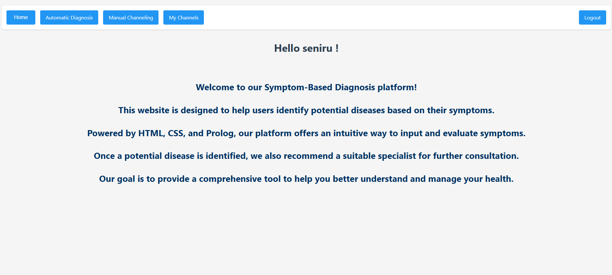
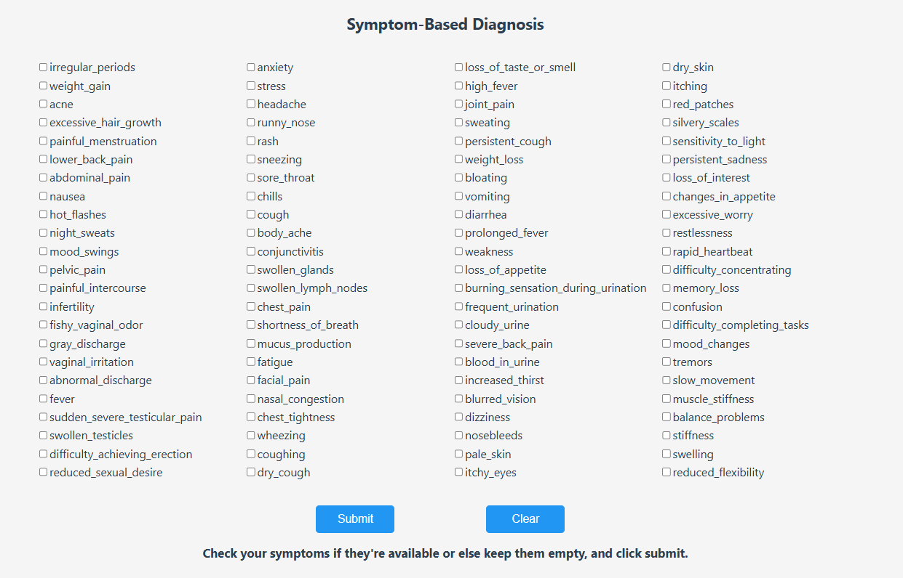
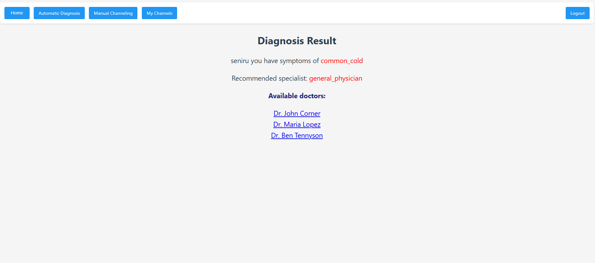

# Doctor Channeling System (Prolog-based Web Application)

This is a web-based Doctor Channeling System developed using SWI-Prolog. It offers both manual and intelligent assistance for booking doctor appointments based on user needs.

## 🔧 Features

- 🔐 **User Registration and Login**: Create and access personal user accounts securely.
- 🩺 **Manual Channeling**: Browse and channel doctors manually by their specializations.
- 🧠 **Intelligent Symptom Analysis**: Automatically identify potential diseases based on symptoms and suggest suitable doctors accordingly.

---

## 📁 Project Structure

- `web_interface.pl` – Main file that contains the web server and core logic.
- Other `.pl` files – Prolog knowledge bases containing facts and domain-specific rules used by `web_interface.pl`.

---

## 🚀 Getting Started

### 🛠 Prerequisites

- Install [SWI-Prolog](https://www.swi-prolog.org/Download.html) on your system.

### ▶️ Running the Application

1. Open your terminal or command prompt.
2. Navigate to the directory containing the Prolog files.
3. Run the following command:

   ```bash
   swipl -s web_interface.pl
4. Once the server has started, open your web browser and go to: 
http://localhost:8080/

### UI




